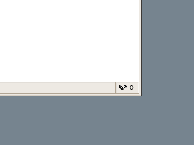
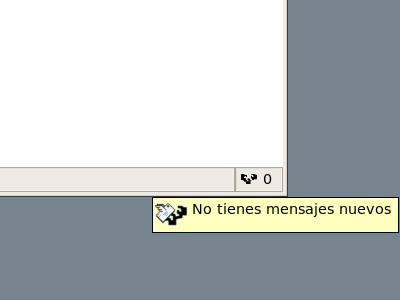
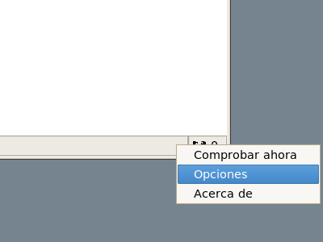
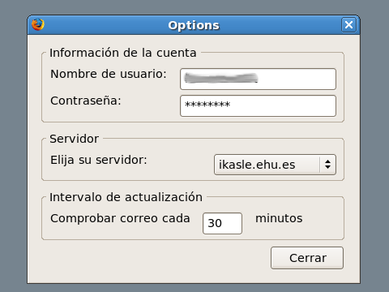
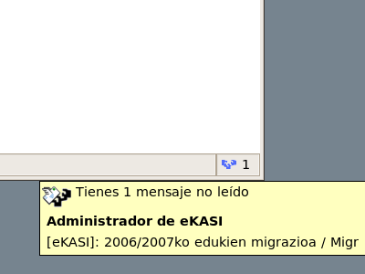

# ehu-mail-notifier

## Disclaimer

This a really old project no longer working, but I keep it here for historical reasons. The old project URL was https://code.google.com/archive/p/ehu-mail-notifier/

This a Mozilla Firefox extension for the UPV/EHU mail which notifies of the number of unread messages and allows you to go directly there.

## Descripción

EHU Mail Notifier es una extensión para Mozilla Firefox que sirve para ver el número de correos que hay sin leer en la cuenta de correo de la UPV/EHU y que permite acceder directamente a ella. Esta extensión nació para aprender algo sobre la tecnología de Firefox (y de Mozilla en general) y para evitar tener que estar metiendo siempre el nombre de usuario, contraseña, servidor e idioma en esa incómoda página que existe para acceder al correo.

## Revisiones

* 0.8.4
  * Adaptado a la última versión del correo web
  * Añadida compatibilidad con Firefox 3.6
* 0.8.3
  * Añadida compatibilidad con Firefox 3.5
* 0.8.2
  * Resuelto un error que impide que se instale en versiones de Firefox superiores a la 3.0.0
* 0.8.1
  * Añadida compatibilidad con Firefox 3
* 0.8.0
  * Adaptado al nuevo correo web basado en Horde e IMP
  * Actualización de servidores disponibles
* 0.7.3
  * Resuelto un error que impedía guardar los cambios en las opciones
* 0.7.2
  * Resuelto un error con la detección del idioma que impedía que funcionara bien en Ubuntu
* 0.7.1
  * Resuelto un error que impedía que funcionara bien con el servidor mailin.ehu.es
* 0.7.0
  * Limpieza de código
  * Reestructuración y mejoras en la localización
  * Ahora con el ratón encima muestra un popup con el remitente y el asunto de los mensajes no leídos
  * Cambio en el código de colores: azul si hay mensajes sin leer, negro si no hay y rojo si hay algún problema o si la extensión no está configurada aún
* 0.6.1
  * Resuelto un error que impedía que funcionara correctamente con la apariencia CLASSIC del correo
* 0.6.0
  * Compatible con Firefox 2.0
  * Cambio de icono cuando hay mensajes nuevos sin leer
  * Ahora directamente abre la página de la bandeja de entrada con lo que además deja de aparecer el nombre de usuario y la contraseña en la barra de direcciones
  * Iconos con fondo transparente
* 0.5.0
  * Diálogo de opciones para introducir nombre de usuario, contraseña, servidor, idioma e intervalo de chequeo
  * Aumentado el número de caracteres para el nombre de usuario y contraseña a 18
  * Traducciones a euskera, castellano e inglés
  * Posibilidad de ir a la página principal del correo
* 0.1.0
  * Versión inicial

## Capturas de pantalla

## Contacto

Borja Tornero <borjatornero@gmail.com>
